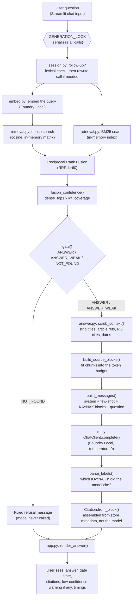

# Architecture

## Component map

| Module | Responsibility |
|---|---|
| `src/extract.py` | Turns `.doc`/`.docx`/`.pdf` into clean Turkish text. Detects file type by magic bytes (not extension), converts `.doc` via LibreOffice, walks document XML in true paragraph/table order, strips repeating headers/footers and page numbers, and flags quality issues (near-empty, mojibake, no Turkish characters, needs OCR) without ever dropping a document silently. |
| `src/titles.py` | Derives a document's identity (title, mevzuat type, number, Resmî Gazete reference) from its own opening text, since EPDK filenames are opaque download IDs. Anything not readable with reasonable confidence is left `None` and flagged, rather than guessed. |
| `src/chunk.py` | Chunks on article (MADDE / GEÇİCİ MADDE / EK MADDE) boundaries — the natural citation unit for legal text — falling back to sub-item splitting, then token windows, for oversized articles or documents with no article structure at all. |
| `src/embed.py` | Thin client for Foundry Local's embedding endpoint: dynamic port discovery, ensuring the model is resident in VRAM, batched calls with retries, and a hard assertion on returned vector dimension. |
| `src/store.py` | SQLite chunk + embedding store. Tracks document identity by content hash so re-ingesting an unchanged corpus embeds nothing new, and marks a changed document's old chunks `active = 0` rather than deleting them (see docs/DECISIONS.md). |
| `src/lexical.py` | An in-memory BM25 index with Turkish diacritic folding, built once at startup alongside the dense matrix. |
| `src/retrieval.py` | Hybrid retrieval: dense cosine similarity fused with BM25 via Reciprocal Rank Fusion, plus the confidence gate that decides whether to answer at all. |
| `src/llm.py` | Chat client for Foundry Local's chat endpoint, plus real-tokenizer-based context budgeting. Strips Qwen3's `<think>` block and classifies context-length failures separately from other generation failures. |
| `src/answer.py` | Generation on top of retrieval: scrubs every citable identifier out of chunk text before the model sees it, builds the prompt, and assembles citations **in code** from the store's own metadata — the model never writes a citation. |
| `src/session.py` | Multi-turn state: follow-up detection (cheap, lexical, no model call for an obviously fresh question), query rewriting for genuine follow-ups, and bounded conversation history. |
| `app.py` | Streamlit UI: password gate, one cached pipeline instance shared across all sessions, a lock serializing every generation call (Foundry Local serves one request at a time), and rendering of gate state, citations, and timings. |

## One question, end to end



The two rankers (dense, BM25) run concurrently in a thread pool — the dense
side is dominated by a blocking HTTP call to Foundry Local that releases the
GIL, so BM25's CPU-bound work overlaps it almost for free.

## Ingest data flow

```mermaid
flowchart LR
    Files["data/mevzuat/raw/**<br/>.doc / .docx / .pdf"] --> Detect["detect_type()<br/>magic bytes, not extension"]
    Detect -->|.doc| LO["LibreOffice<br/>batch convert to .docx"]
    Detect -->|.docx / .pdf| Extract["extract_docx() / extract_pdf()"]
    LO --> Extract
    Extract --> Normalize["normalize_text()<br/>NFC, hyphenation fix,<br/>strip headers/footers/page numbers"]
    Normalize --> Title["titles.py: extract_title()<br/>title, type, number, RG reference"]
    Title --> Chunk["chunk.py: chunk_document()<br/>article boundaries first"]
    Chunk --> EmbedBatch["embed.py: EmbeddingClient<br/>batched, retried"]
    EmbedBatch --> Store["store.py: insert_chunks()<br/>keyed by (file_sha256, chunk_index)"]
    Store --> DB[("data/epdk.db<br/>SQLite, WAL mode")]
```



## Store schema

One table, `chunks`, holding both the text and its embedding:

```sql
CREATE TABLE chunks (
    id            INTEGER PRIMARY KEY AUTOINCREMENT,
    source_path   TEXT NOT NULL,      -- path relative to corpus root; the re-ingest identity
    file_sha256   TEXT NOT NULL,      -- content hash; changes only when EPDK republishes
    document_title TEXT,
    chunk_index   INTEGER NOT NULL,
    text          TEXT NOT NULL,
    article_ref   TEXT,               -- "MADDE 5", "GEÇİCİ MADDE 3", etc.
    page_start    INTEGER,
    page_end      INTEGER,
    quality_flag  TEXT,               -- extraction/title quality issues, if any
    embedding     BLOB NOT NULL,      -- float32, config.EMBEDDING_DIM elements
    embedded_at   TEXT NOT NULL,
    active        INTEGER NOT NULL DEFAULT 1,
    UNIQUE (file_sha256, chunk_index)
);
```

`source_path` (not `file_sha256`) is the identity that persists across a
document's content changing — see docs/DECISIONS.md for why. Retrieval
loads every `active = 1` embedding into one in-memory matrix at startup
(~111 MB for the current ~27k-chunk corpus) rather than paying a per-query
BLOB decode; SQLite is still consulted per query, but only for metadata on
the handful of chunks that made `top_k`.

## Runtime: one process, one shared pipeline

`app.py` loads the retriever and chat client exactly once per process (via
`st.cache_resource`), reused across every Streamlit session and rerun —
including the underlying SQLite connection, opened with
`check_same_thread=False` specifically so it can be shared this way. A
single `threading.Lock` serializes every question end to end, because
Foundry Local's local server serves exactly one request at a time; a second
session's question waits with a visible "sırada bekliyor" state rather than
silently queuing or erroring. See docs/DEMO.md question 6 for this
demonstrated live.
